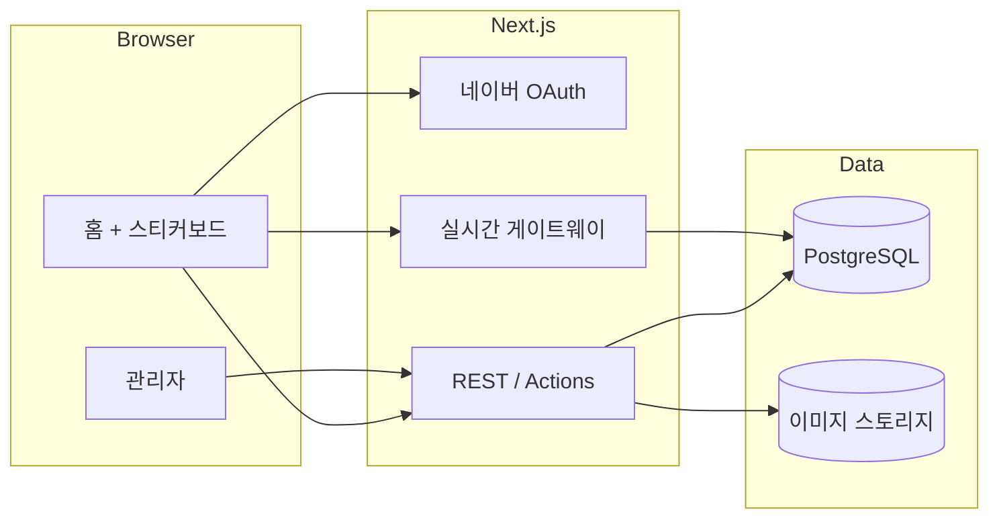

# 프로젝트 계획서

**Plan ID**: PLAN-000001  
**생성일**: 2026-05-21

## 프로젝트 아이디어

버튜버 **별으잉**의 공식 사이트. 방송 정보·이미지·외부 링크를 보여주는 홈과, **시청자가 로그인 후 함께 꾸미는 스티커보드**를 핵심 경험으로 한다.

## 목적

- 별으잉의 공식 허브: 방송 일정·상태, 대표 이미지, 유튜브·굿즈 등 링크를 한곳에서 제공한다.
- **시청자 참여형** 공간: 방송인이 직접 꾸미는 것보다, 로그인한 팬이 스티커·텍스트로 보드를 꾸미는 것이 메인 활동이 되도록 한다.
- **네이버 로그인**으로 한국 사용자 친화적 인증을 제공하고, 로그인 사용자만 보드 편집 권한을 부여한다.
- 방송인(관리자)은 방송 메타·커스텀 스티커·보드 운영(삭제·신고 처리)을 담당한다.

## 핵심 기능

### 1. 메인 홈

- **방송 정보**: 현재 방송 상태(라이브/오프라인), 제목·플랫폼 링크, 예정 일정(선택).
- **비주얼**: 대표 이미지·배너(관리자 업로드 또는 URL).
- **링크 모음**: 유튜브, 굿즈샵, SNS 등 카드/아이콘 형태의 외부 링크(관리자 CRUD).
- **스티커보드 영역**: 홈 상단 또는 중앙에 **대형 캔버스**로 배치. 스크롤 시에도 보드가 시각적 중심이 되도록 레이아웃 설계.

### 2. 네이버 로그인

- 네이버 개발자센터 OAuth 2.0 연동.
- 로그인 시 사용자 식별자·닉네임·프로필 이미지(네이버 제공 범위) 저장.
- 비로그인: 홈·링크·방송 정보 **열람만** 가능. 스티커·텍스트 배치 **불가**.
- 로그아웃·세션 만료 처리.

### 3. 스티커보드 (시청자 중심)

**편집 권한**: 네이버 로그인 사용자.

**배치 가능 요소**

| 종류 | 출처 | 설명 |
|------|------|------|
| 기본 스티커 | 시스템 기본 팩 | 모든 로그인 사용자에게 제공되는 공통 이모티콘/스티커 세트 |
| 커스텀 스티커 | 방송인 등록 | 관리자가 업로드·활성화한 별으잉 전용 스티커 |
| 텍스트 | 사용자 입력 | 색·크기 제한된 짧은 텍스트 라벨 (욕설·URL 스팸 방지 규칙 적용) |

**인터랙션**

- 드래그로 위치 이동, 선택 후 삭제(본인이 붙인 것만 삭제 가능).
- 보드 좌표는 서버에 저장되어 **새로고침·재방문 시 유지**.
- 다른 사용자가 붙인 스티커는 **실시간으로 반영**(WebSocket 또는 SSE). 협업 꾸미기 경험을 우선한다.

**보드 단위**

- **메인 보드 1개**: 사이트 전체의 영구 캔버스. 시청자 꾸미기의 기본 무대.
- (후속 피쳐) 방송 회차·이벤트별 **스냅샷/아카이브 보드**는 2단계에서 검토. 1단계는 메인 보드만 구현.

**운영·안전**

- 방송인(관리자)은 **임의 요소 삭제** 권한.
- 사용자 **신고** → 관리자 대시보드에서 처리.
- 사용자당 **배치 개수·쿨다운** 제한으로 스팸 완화.
- 텍스트: 길이 상한, 금칙어 필터(간단 목록 + 확장 가능).

### 4. 관리자(방송인) 기능

- 방송 정보·링크·홈 이미지 CRUD.
- 커스텀 스티커 업로드(PNG/WebP, 크기·용량 제한), 활성/비활성.
- 스티커보드 신고 목록·일괄 삭제.
- (선택) 라이브 상태 수동 토글 또는 외부 API 연동은 2단계.

### 5. 비관리자 사용자 경험

- 로그인 → 기본·커스텀 스티커 팔레트 + 텍스트 입력 UI 표시.
- 보드 줌/패닝(모바일 핀치)으로 큰 캔버스 탐색.
- 본인이 붙인 스티커 목록에서 빠른 삭제(선택).

## 사용자 시나리오

1. **비로그인 방문자**: 홈에서 방송 정보·링크 확인, 스티커보드는 **보기만** 하며 다른 사람이 붙인 꾸밈이 실시간으로 보인다.
2. **로그인 팬**: 네이버 로그인 후 팔레트에서 스티커 선택 → 보드에 드롭, 텍스트 추가, 위치 조정. 친구가 붙인 스티커가 곧바로 나타난다.
3. **방송인(관리자)**: 관리 페이지에서 오늘 방송 링크 수정, 새 굿즈 링크 추가, fan art 성격의 커스텀 스티커 업로드. 부적절한 배치는 삭제·신고 처리.

## 기술 스택

| 영역 | 선택 | 비고 |
|------|------|------|
| 프론트엔드 | **Next.js** (App Router) + TypeScript | SSR/SEO, API Routes 통합 |
| UI | Tailwind CSS + shadcn/ui | 빠른 홈·관리 UI |
| 인증 | 네이버 OAuth 2.0 + **NextAuth.js** (또는 Auth.js) | Naver Provider |
| API | Next.js Route Handlers / Server Actions | |
| 실시간 | **Socket.io** (또는 Pusher/Ably 등 매니지드) | 스티커 배치·이동·삭제 브로드캐스트 |
| DB | **PostgreSQL** | 스티커·사용자·메타 영구 저장 |
| ORM | Prisma | 마이그레이션·타입 안전 |
| 파일 저장 | S3 호환(Object Storage) 또는 Vercel Blob | 커스텀 스티커·홈 이미지 |
| 배포 | Vercel (프론트+API) + Neon/Supabase(Postgres) | 초기 운영 단순화 |

## 데이터 모델 (개요)

- `User`: naverId, nickname, profileImage, role(`user` | `admin`)
- `BroadcastInfo`: status, title, platformUrl, scheduledAt, updatedAt
- `SiteLink`: label, url, icon, sortOrder, isActive
- `HomeAsset`: type(banner/hero), url, alt
- `StickerPack`: type(`default` | `custom`), name, isActive
- `Sticker`: packId, imageUrl, name, sortOrder
- `BoardItem`: id, boardId(`main`), userId, type(`sticker` | `text`), stickerId?, text?, x, y, rotation, scale, zIndex, createdAt
- `Report`: boardItemId, reporterId, reason, status

## 아키텍처 개요

## 제약사항 / 요구사항

- **공식 사이트** 톤: 별으잉 브랜딩(색·폰트·로고)은 초기에 placeholder 가능, 추후 에셋 교체 용이하게.
- **네이버 로그인 필수**; 다른 소셜은 1단계 범위 외.
- 스티커보드는 **데스크톱·모바일** 모두 사용 가능해야 함(터치 드래그·반응형 팔레트).
- 개인정보: 네이버에서 받는 최소 정보만 저장, 이용약관·개인정보 처리방침 페이지 필요.
- 네이버·유튜브 등 **외부 링크는 새 탭** + rel 정책 준수.
- 관리자 계정은 DB `role` 또는 allowlist(naverId)로 제한.

## 구현 단계 (권장 순서)

### Phase 1 — 기반·홈·인증

1. Next.js 프로젝트 초기화, DB·Prisma, 환경 변수 템플릿.
2. 네이버 OAuth 로그인·세션·User 테이블.
3. 홈 레이아웃: 방송 정보, 이미지, 링크 CRUD(관리자), 비로그인 열람.

### Phase 2 — 스티커보드 MVP

4. 메인 보드 캔버스 UI(드래그·좌표 저장).
5. 기본 스티커 팩 + 로그인 사용자 배치·본인 삭제.
6. 실시간 동기화(타 사용자 배치 반영).
7. 텍스트 배치 + 길이·금칙어 제한.

### Phase 3 — 방송인·운영

8. 커스텀 스티커 업로드·관리자 활성화.
9. 관리자 임의 삭제·신고 플로우.
10. 배치 쿨다운·개수 제한.

### Phase 4 — 마무리

11. 이용약관·개인정보 페이지, 메타/OG 태그(SEO).
12. 성능·모바일 QA, 프로덕션 배포.

## 성공 기준

- 비로그인 사용자가 방송 정보·링크·스티커보드를 **열람**할 수 있다.
- 네이버 로그인 사용자가 기본·커스텀 스티커와 텍스트로 보드를 꾸미고, **다른 사용자의 변경이 실시간**으로 보인다.
- 방송인이 방송 정보·링크·커스텀 스티커를 관리하고, 부적절한 보드 요소를 제거할 수 있다.

## 리스크 및 대응

| 리스크 | 대응 |
|--------|------|
| 스티커 스팸·도배 | 개수 제한, 쿨다운, 신고·관리자 삭제 |
| 실시간 연결 부하 | Socket 인스턴스·매니지드 서비스, 보드 영역 단일(main) |
| 모바일 캔버스 UX | 터치 이벤트·팔레트 하단 고정, 줌 UI |
| 네이버 OAuth 심사·콜백 URL | 개발/프로덕션 redirect URI 사전 등록 |

## 2단계 후보 (범위 외)

- 방송 회차별 아카이브 보드·스냅샷
- SOOP/CHZZK 등 라이브 API 자동 연동
- 스티커 좋아요·랭킹
- 다국어
